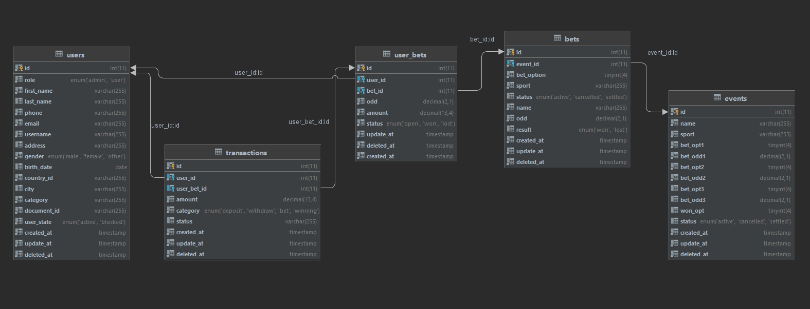

# GreenRun - Sports

This repository has a demonstration about an API that could be used for a sportsbook application.

## Deployed in Heroku
You can use this URL to make tests of the API:
- https://grenrun-sports.herokuapp.com/

## Technologies & frameworks used
- Nodejs
- Typescript
- MySQL
- Hapi
- Knex
- Heroku

## Database diagram

This is the proposal for managing the creation of different types of transactions, such as deposits, withdrawals, bets and rewards when winning.

## Endpoints usage

The information about this section will be updated soon...

## Pending implementations
- Demo video of the API usage
- Add endpoint descriptions
- Add authentication for the roles' usage.

## Authors
- Cristian Pinzon